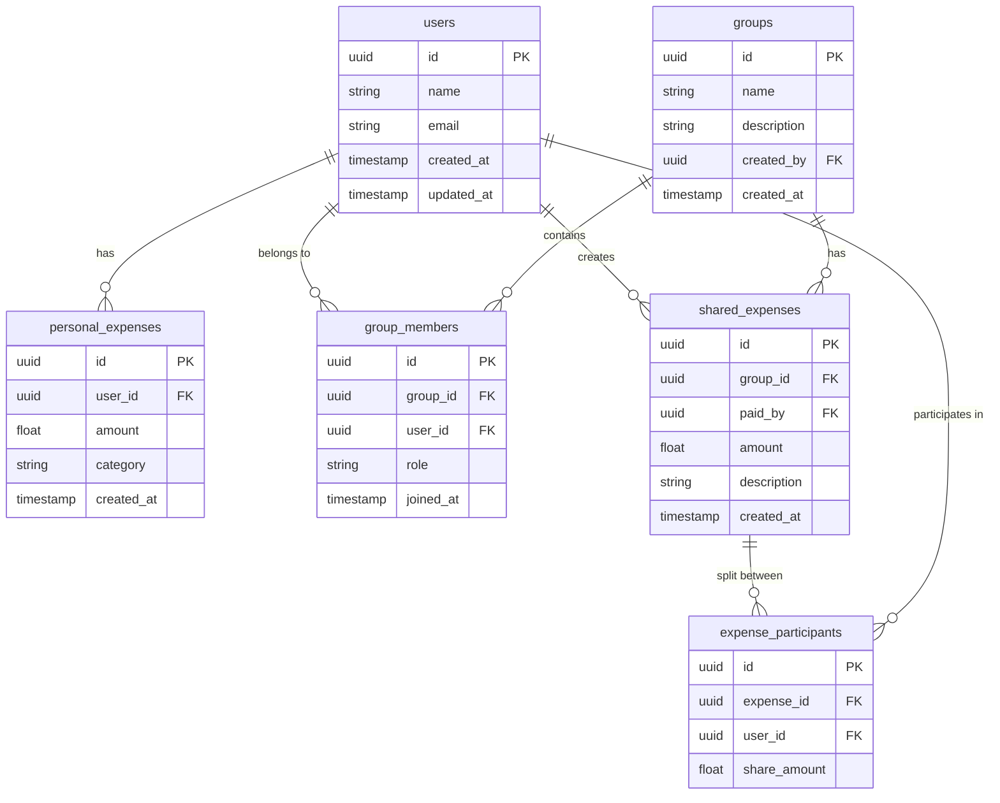

# Xpance Manager

A modern expense tracking and budget management app built with React Native and Supabase.

## Features

- 📱 Cross-platform (iOS & Android)
- 💰 Track personal and shared expenses
- 👥 Group expense management
- 📊 Detailed analytics and insights
- 📈 Visual reports with charts
- 🔄 Real-time sync across devices
- 🔒 Secure authentication (Email & Google)
- 💳 Multiple currency support
- 📱 Modern UI/UX with Material Design
- 📄 PDF report generation and sharing
- 🖼️ Profile photo management
- 🌙 Responsive layouts

## Tech Stack

- React Native with Expo
- TypeScript
- Supabase (Backend & Authentication)
- React Navigation
- Victory Native & React Native Chart Kit
- Expo File System & Sharing
- Material Icons
- React Native SVG

## Prerequisites

- Node.js (14.0 or higher)
- Expo CLI
- Supabase account
- iOS Simulator / Android Emulator

## Installation

1. Clone the repository

```bash
git clone https://github.com/yourusername/xpance-manager.git
cd xpance-manager
```

2. Install dependencies

```bash
npm install
```

3. Create a `.env` file in the root directory with your Supabase credentials:

```
SUPABASE_URL=your_supabase_url
SUPABASE_ANON_KEY=your_supabase_anon_key
```

4. Start the development server

```bash
npm start
```

## Project Structure

```
src/
├── components/     # Reusable UI components
├── screens/        # App screens
├── hooks/          # Custom React hooks
├── utils/          # Helper functions
├── types/         # TypeScript type definitions
├── lib/           # External service configurations
└── assets/        # Images, fonts, etc.
```

## Database Schema

The app uses Supabase with the following main tables:



## Features in Detail

### Expense Management

- Track personal and shared expenses
- Categorize expenses
- Split bills among group members
- Multiple currency support

### Analytics

- Visual expense breakdowns
- Category-wise analysis
- Time-based filtering (Today/Week/Month/Year)
- Downloadable PDF reports

### Group Management

- Create and manage expense groups
- Add/remove members
- Track group balances
- Role-based permissions (admin/member)

### User Profile

- Profile photo management
- Personal information updates
- Security settings
- Notification preferences

## Contributing

1. Fork the repository
2. Create your feature branch (`git checkout -b feature/AmazingFeature`)
3. Commit your changes (`git commit -m 'Add some AmazingFeature'`)
4. Push to the branch (`git push origin feature/AmazingFeature`)
5. Open a Pull Request

## License

This project is licensed under the MIT License - see the LICENSE file for details

## Contact

Your Name - [@yourtwitter](https://twitter.com/yourtwitter)
Project Link: [https://github.com/yourusername/xpance-manager](https://github.com/yourusername/xpance-manager)
